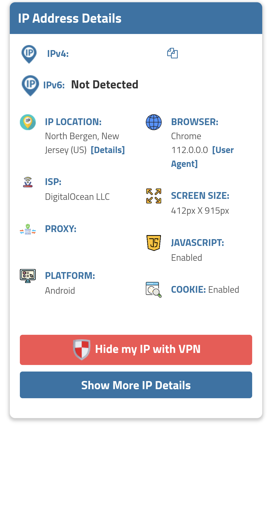

# Docker-Wireguard
ITM 684 Docker Wireguard Project
This project is done with the assumption that you have a [DigitalOcean](https://www.digitalocean.com/) account with a droplet running Ubuntu already.

Step 1: [Install Docker](https://thematrix.dev/install-docker-and-docker-compose-on-ubuntu-20-04/) 
1. Open up DigitalOcean console. Make sure you are not logged on as the root user.
2. A few thing are needed before installing docker
	1. We need to install the neccessary tools
	`sudo apt install apt-transport-https ca-certificates curl software-properties-common -y`
	 1. Next comes the Docker key
		 `curl -fsSL https://download.docker.com/linux/ubuntu/gpg | sudo apt-key add -`
	 1.  Add the Docker Repo (I have 64-bit OS)
			`sudo add-apt-repository \
			"deb [arch=amd64] https://download.docker.com/linux/ubuntu \
			$(lsb_release -cs) \
			stable" ` 
	 2. Switch to the correct repository
			`apt-cache policy docker-ce`
3. Install Docker
		`sudo apt install docker-ce -y`

Step 2: Setup [Wiregurard](https://thematrix.dev/setup-wireguard-vpn-server-with-docker/)
Once Docker is installed, there are certain things that needs to be done before we start wireguard
1. We start by running these
`mkdir -p ~/wireguard/
mkdir -p ~/wireguard/config/
nano ~/wireguard/docker-compose.yml`

2. With the fie open, copy and paste the content below.

version: '3.8'
services:
  	wireguard:
    	container_name: wireguard
    	image: linuxserver/wireguard
    	environment:
     	 - PUID=1000
       - PGID=1000
     	 - TZ=Asia/Hong_Kong
    	 - SERVERURL=1.2.3.4
    	 - SERVERPORT=51820
    	 - PEERS=pc1,pc2,phone1
  	 - PEERDNS=auto
   	 - INTERNAL_SUBNET=10.0.0.0
    ports:
      - 51820:51820/udp
    volumes:
      - type: bind
        source: ./config/
        target: /config/
      - type: bind
        source: /lib/modules
        target: /lib/modules
    restart: always
    cap_add:
      - NET_ADMIN
      - SYS_MODULE
    sysctls:
      - net.ipv4.conf.all.src_valid_mark=1
      
A few things to make sure:
	1. TZ is timezone. Make sure to select your timezone properly. You can find your timezone in the TZ database name from this [Wikipedia page](https://en.wikipedia.org/wiki/List_of_tz_database_time_zones). For security purposes I did not show my changes above.
	2. SERVERURL refers to the IP address of your server, which you can find on your DigitalOcean dashboard
	3. PEERS are the number of user config files to generate. You can modify or add more as needed.
Once you are done editing the file, save and exit the file.

3. Now that we have the the setup done, we can finally run Wireguard
	1. Start Wireguard:
		`cd ~/wireguard/
		 docker-compose up -d`
	2. If you are planning to connect the Wireguard to your phone, you need to generate the QR code for the client to scan. The QR code can be generated with this command:
	`docker-compose logs -f wireguard`
	3. If all the configs are written right, you should see the QR code.
	4. On the smartphone Wireguard cient, scanning the QR code is as simple as clicking the + -> Scan from QR Code.
	5. After sertting it up properly, you can run it. It is best to use an ip locator site like [this](https://www.iplocation.net/) to check that the current ip location is different than after you run the Docker Wireguard.

  

The first image shows docker enabled on my phone. As you can see, for my phone, when it is enabled, I can see a lock by the wifi bars (red underline). That icon can vary by phone. The next screenshot shows the IP and location before I had enabled the docker Wireguard. As you can see, the current location iss Hawaii. Once I got the Wireguard on, you can see the third screenshot. As you can see, the IP location has now changed and is showing the location of my DigitalOcean account. Also, under ISP, I can that it is DigitalOcean LLC.

And there you go, congratulations! You have successfully installd Wireguard with Docker on your DigitalOcean server.

